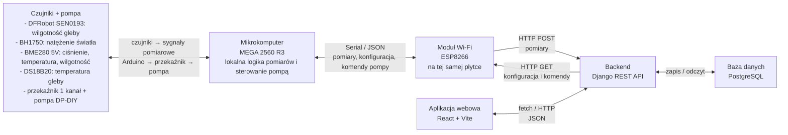
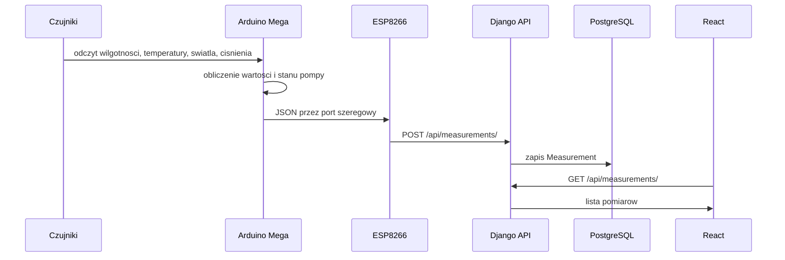
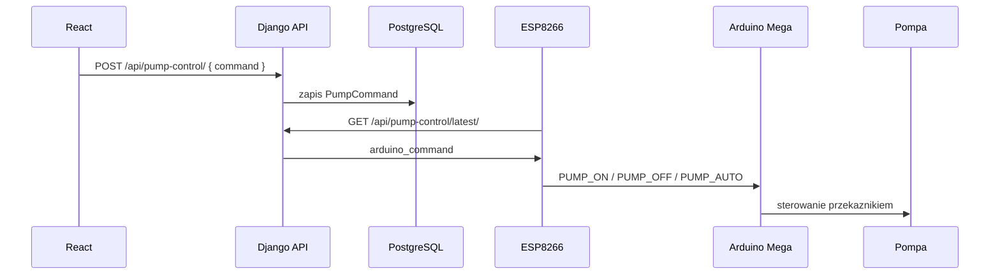

# 02. Architektura systemu

## Widok ogolny

System sklada sie z pieciu glownych warstw:

1. Warstwa sprzetowa: czujniki, pompa, przekaznik, Arduino Mega.
2. Warstwa komunikacji Wi-Fi: ESP8266.
3. Backend: Django REST API.
4. Baza danych: PostgreSQL.
5. Frontend: aplikacja React uruchamiana przez Vite.



## Przeplyw danych pomiarowych



## Przeplyw sterowania pompa



## Przeplyw konfiguracji czujnikow

Uzytkownik podczas tworzenia eksperymentu podaje czestotliwosci odczytu dla czujnikow. Backend zapisuje je w polu `sensor_frequencies`. ESP8266 cyklicznie pobiera aktywna konfiguracje endpointem:

```text
GET /api/experiments/active-sensor-config/?sensor_set_id=1
```

Nastepnie ESP8266 buduje komende tekstowa:

```text
CONFIG:soil_moisture=30;light=60;soil_temperature=120;air_temperature=60;air_humidity=60;pressure=180
```

Arduino odbiera komende przez port szeregowy i aktualizuje interwaly odczytu.

## Podzial katalogow

| Sciezka | Znaczenie |
| --- | --- |
| `backend/` | Backend Django, Dockerfile, docker-compose, requirements. |
| `backend/app/config/` | Konfiguracja projektu Django: settings, glowne URL-e. |
| `backend/app/measurements/` | Model i API pomiarow z czujnikow. |
| `backend/app/experiments/` | Model i API eksperymentow. |
| `backend/app/sensors/` | Model i API definicji czujnikow. |
| `backend/app/users/` | API uzytkownikow i profil uzytkownika. |
| `backend/app/pump_control/` | API komend sterowania pompa. |
| `frontend/` | Aplikacja React + Vite. |
| `frontend/src/pages/` | Ekrany aplikacji. |
| `arduino/` | Szkice Arduino i ESP8266. |
| `.github/workflows/` | Konfiguracja GitHub Actions. |
| `docs/` | Dokumentacja projektu. |

## Technologie

### Backend

- Python 3.12 w obrazie `python:3.12-slim`.
- Django 5
- Django REST Framework.
- django-cors-headers.
- psycopg2-binary do polaczenia z PostgreSQL.
- openpyxl do eksportu plikow Excel.

### Frontend

- React 19.
- Vite 8.
- React Router.
- Recharts.
- CSS w `frontend/src/App.css` i `frontend/src/index.css`.

### Baza danych

- PostgreSQL 16 uruchamiany w Docker Compose.
- Wolumen `postgres_data` przechowuje dane poza cyklem zycia kontenera.

### Sprzet

- Arduino Mega.
- ESP8266.
- BME280.
- BH1750.
- DS18B20.
- Analogowy czujnik wilgotnosci gleby.
- Przekaznik i pompa.

## Porty

| Port | Usluga |
| --- | --- |
| `8000` | Backend Django REST API. |
| `5432` | PostgreSQL. |
| `5173` | Frontend Vite w trybie developerskim. |
| `9600` | Predkosc komunikacji Serial w szkicach Arduino/ESP. |

